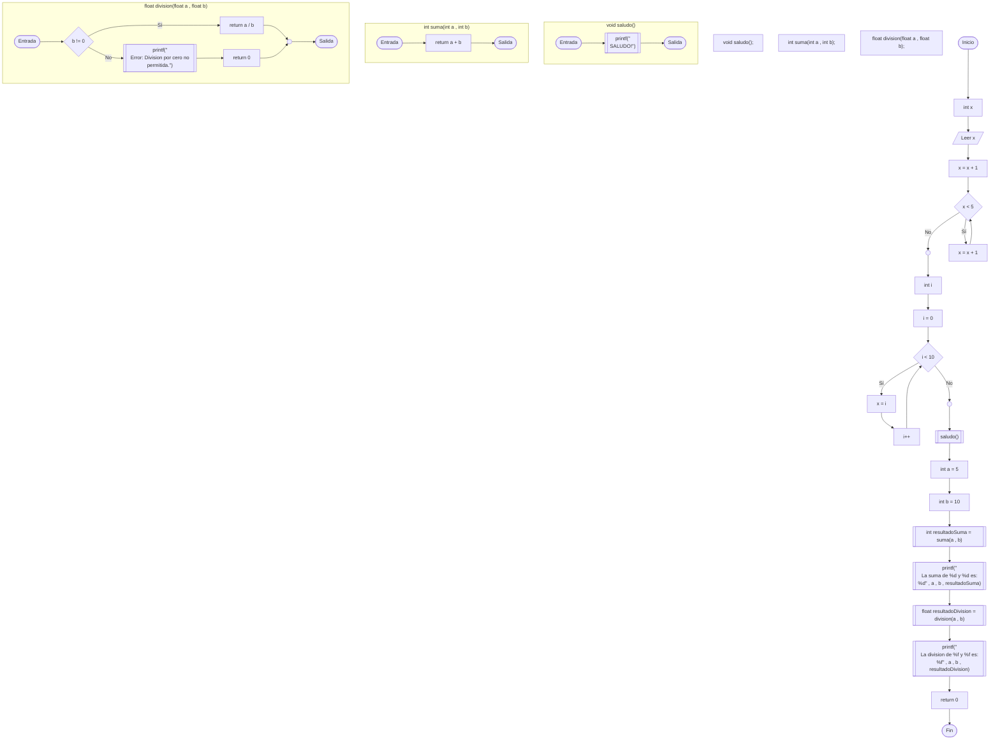
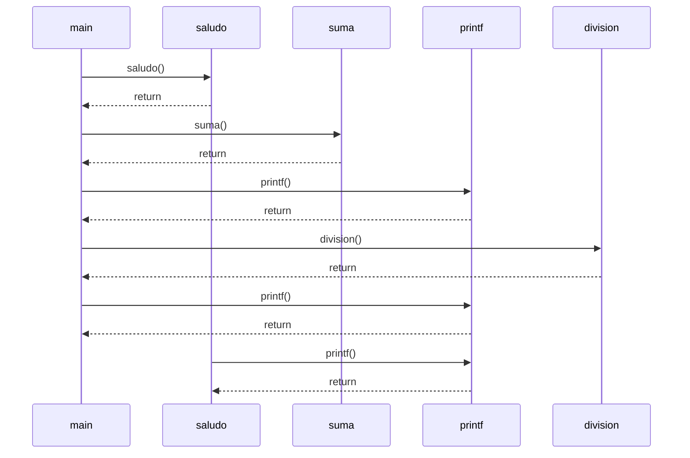

# CodeToMermaid

> **Traductor de código C a pseudocódigo Mermaid** para la generación automática de diagramas de flujo y diagramas de secuencia.

---

## Descripción del Proyecto

[CodeToMermaid](README.md) es una herramienta educativa escrita en **Java** que actúa como un compilador frontend (Analizador Léxico y Analizador Sintáctico con Árbol de Sintaxis Abstracta) y backend generador de diagramas. Toma código fuente en lenguaje **C** como entrada, lo procesa mediante un árbol de sintaxis abstracta (AST) y genera diagramas en formato **Mermaid**.

Además de imprimir el código Mermaid en consola, el traductor genera automáticamente un enlace con la representación codificada en **Base64** y abre el navegador por defecto en **Mermaid Live Editor** para que el usuario pueda visualizar, editar e interactuar con el diagrama de flujo de inmediato.

---

## Características Principales

*   **Análisis Léxico Robustecido**: Escaneo de palabras clave de C, operadores relacionales/aritméticos, directivas de preprocesador e identificadores mediante expresiones regulares en [CLexer.java](src/CLexer.java).
*   **Análisis Sintáctico (Parser AST)**: Construcción de un árbol de sintaxis abstracta (AST) mediante descenso recursivo en [CParser.java](src/CParser.java).
*   **Generación de Diagramas de Flujo (`graph TD`)**: Representación visual de flujos de control complejos.
*   **Generación de Diagramas de Secuencia (`sequenceDiagram`)**: Representación de las interacciones y llamadas entre funciones si estas existen y se detectan llamadas en el AST.
*   **Integración Web Instantánea**: Serialización automática del diagrama en JSON, codificación Base64 y redirección al editor web oficial de Mermaid.

---

## Estructura del Código Fuente

El proyecto está organizado en las siguientes clases y componentes clave dentro de la carpeta [src](src):

| Componente / Archivo | Tipo | Descripción |
| :--- | :--- | :--- |
| [TraductorPrincipal.java](src/TraductorPrincipal.java) | Clase Principal | Punto de entrada. Lee el archivo fuente de C, ejecuta el lexer, parser, backend de generación y abre el navegador con la URL en Base64. |
| [CLexer.java](src/CLexer.java) | Analizador Léxico | Convierte la cadena de texto de entrada en una lista de tokens, manejando comentarios y saltos de línea. |
| [CParser.java](src/CParser.java) | Analizador Sintáctico | Analiza sintácticamente la lista de tokens, validando la estructura del programa de acuerdo a la gramática C implementada y construyendo el AST. |
| [TipoToken.java](src/TipoToken.java) | Enumerador | Define todas las expresiones regulares para identificar palabras reservadas, operadores, delimitadores y literales. |
| [Token.java](src/Token.java) | Modelo | Representa un token individual (tipo y lexema). |
| [ContextoMermaid.java](src/ContextoMermaid.java) | Auxiliar | Gestiona la generación secuencial y única de IDs para los nodos de flujo (`nodo0`, `nodo1`, etc.) y el acumulador del diagrama de flujo. |
| [ContextoMermaidSequence.java](src/ContextoMermaidSequence.java) | Auxiliar | Acumulador de sentencias para la generación del diagrama de secuencia. |

### Clases del AST (Nodos)

Cada nodo hereda de [NodoTablaSimbolo.java](src/NodoTablaSimbolo.java) (clase base para los elementos sintácticos) y define cómo se traduce dicho bloque a Mermaid:

*   [NodoPrograma.java](src/NodoPrograma.java): Nodo raíz. Gestiona la traducción global, subgrafos de funciones y el diagrama de secuencia.
*   [NodoBloque.java](src/NodoBloque.java): Agrupación secuencial de instrucciones.
*   [NodoIfElse.java](src/NodoIfElse.java): Genera nodos de decisión (`id{"condicion"}`) y conecta flujos de verdadero/falso hacia un nodo común de unión (`id(( ))`).
*   [NodoWhile.java](src/NodoWhile.java): Genera bucles de flujo con retorno a la condición evaluada.
*   [NodoDoWhile.java](src/NodoDoWhile.java): Genera bucles de flujo donde el bloque se ejecuta antes de la condición.
*   [NodoFor.java](src/NodoFor.java): Genera la inicialización, la condición de parada, el cuerpo y el incremento de la variable de control.
*   [NodoSwitch.java](src/NodoSwitch.java): Traduce múltiples casos de evaluación y una opción por defecto.
*   [NodoDefinicionFuncion.java](src/NodoDefinicionFuncion.java): Genera un `subgraph` dedicado en Mermaid para cada función definida.
*   [NodoLlamadaFuncion.java](src/NodoLlamadaFuncion.java): Representa llamadas a funciones del sistema (`printf`, etc.) o funciones de usuario.
*   [NodoAsignacion.java](src/NodoAsignacion.java): Representa la asignación de expresiones a variables (`x = y + 1`).
*   [NodoDeclaracion.java](src/NodoDeclaracion.java): Modela la declaración de variables y arreglos con o sin asignación inicial.
*   [NodoReturn.java](src/NodoReturn.java): Modela sentencias de retorno de funciones (`return valor`).
*   [NodoLectura.java](src/NodoLectura.java): Modela sentencias de lectura de datos (`scanf`).
*   [NodoExit.java](src/NodoExit.java): Modela la llamada a la finalización del proceso (`exit`).
*   [NodoPrototipo.java](src/NodoPrototipo.java): Representa declaraciones de prototipos de funciones.

---

## Sintaxis de C Soportada y su Equivalente en Mermaid

El traductor soporta los siguientes bloques y construcciones estructurales:

| Estructura en C | Representación Visual en Mermaid | Tipo de Nodo Mermaid |
| :--- | :--- | :--- |
| **Inicio / Fin** | `([Inicio])` / `([Fin])` | Elipse de inicio/parada |
| **Declaraciones y Operaciones** | `nodo["x = x + 1"]` | Rectángulo de proceso |
| **Llamadas/Salidas (printf)** | `nodo[["printf(...)"]]` | Subproceso (rectángulo de doble contorno) |
| **Lectura de Entrada (scanf)** | `nodo[/scanf(...)/]` | Paralelogramo de entrada/salida |
| **Bifurcaciones (if / switch)** | `nodo{"x < 5"}` | Rombo de decisión |
| **Bucles (while / for)** | Retornos de flujo hacia el rombo | Ciclo cerrado de repetición |
| **Punto de Unión** | `nodo(( ))` | Círculo pequeño para juntar ramas |
| **Funciones** | `subgraph nombreFuncion` | Subgráfico contenedor |

---

## Compilación y Ejecución

Asegúrate de tener instalado **Java JDK (versión 8 o superior)** en tu sistema.

### 1. Compilación
Compila todos los archivos `.java` dentro del directorio [src](src) y guarda los binarios compilados en la carpeta `bin/`:
```bash
javac -d bin src/*.java
```

### 2. Ejecución
Ejecuta el traductor especificando la ruta al classpath de los binarios:
```bash
java -cp bin TraductorPrincipal
```

> [!NOTE]
> Por defecto, la clase principal [TraductorPrincipal.java](src/TraductorPrincipal.java) leerá el archivo de entrada [codigo.c](codigo.c) ubicado en la raíz del proyecto. Puedes cambiar el archivo a procesar modificando la variable `archivoCodigo` en la línea 11 de [TraductorPrincipal.java](src/TraductorPrincipal.java).

---

## Ejemplo de Traducción

A continuación se muestra cómo se traduce el archivo de prueba actual [codigo.c](codigo.c):

### Código C de Entrada

```c
#include <stdio.h>
#include <stdlib.h>

void saludo();
int suma(int a, int b);
float division(float a, float b);

int main()
{
    int x;
    scanf("%d", &x);
    x = x + 1;
    while (x < 5)
    {
         x = x + 1;
    }
    int i;
    for (i = 0 ; i < 10; i = i + 1)
    {
        x = i;
    }
    saludo();

    int a = 5;
    int b = 10;
    int resultadoSuma = suma(a, b);
    printf("\n La suma de %d y %d es: %d", a, b, resultadoSuma);
    float resultadoDivision = division(a, b);
    printf("\n La division de %f y %f es: %f", a, b, resultadoDivision);
    return 0;
}

void saludo()
{
    printf("\n SALUDO!");
}

int suma(int a, int b)
{
    return a + b;
}

float division(float a, float b)
{
    if (b != 0)
    {
        return a / b;
    }
    else
    {
        printf("\n Error: Division por cero no permitida.");
        return 0; // Retorna 0 o algun valor que indique error
    }
}
```

### 1. Diagrama de Flujo generado (`graph TD`)



### 2. Diagrama de Secuencia generado (`sequenceDiagram`)



---

## ¿Cómo funciona la apertura automática del navegador?

El método `abrirEnNavegador` de [TraductorPrincipal.java](src/TraductorPrincipal.java) realiza los siguientes pasos:
1. Escapa los caracteres especiales del código Mermaid generado (comillas, saltos de línea, barras invertidas) para asegurar un formato JSON válido.
2. Construye un string con formato JSON: `{"code":"...", "mermaid":{"theme":"default"}}`.
3. Codifica el JSON a una cadena **Base64** segura para URLs mediante `Base64.getUrlEncoder().encodeToString(...)`.
4. Genera un enlace dirigido a `https://mermaid.live/edit#base64:<codigo_base64>`.
5. Llama a la API nativa de Java `Desktop.getDesktop().browse(uri)` para iniciar el navegador predeterminado del sistema operativo con el diagrama cargado en tiempo real.
